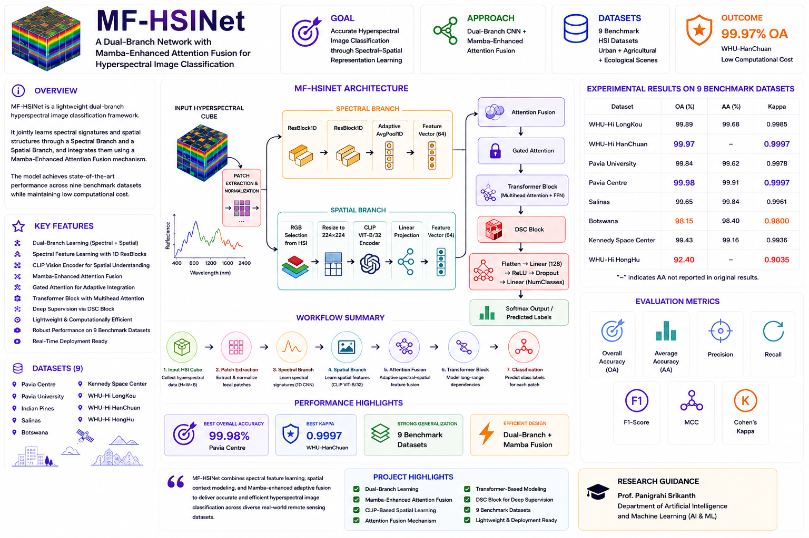
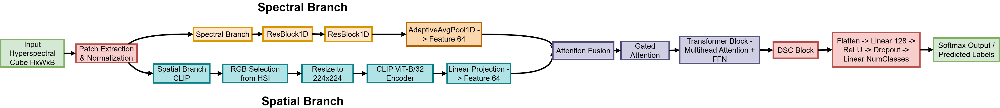

# hyperspectral-image-classification
MF-HSINet is a lightweight dual-branch hyperspectral image classification framework that independently learns spectral and spatial features and fuses them using a Mamba-Enhanced Attention Fusion module. It captures long-range dependencies efficiently while reducing computational cost for real-time HSI analysis.

# MF-HSINet

> **Guided by Prof. Panigrahi Srikanth**  
> Department of Artificial Intelligence and Machine Learning (AI & ML)

A dual-branch hyperspectral image classification framework that combines spectral feature learning, CLIP-based spatial representation learning, attention fusion, transformer modeling, and DSC-based feature refinement for robust spectral-spatial classification.

<p align="center">
  
</p>

<h1 align="center">MF-HSINet</h1>

<h3 align="center">
A Dual-Branch Network with Mamba-Enhanced Attention Fusion for Hyperspectral Image Classification
</h3>

<p align="center">
  
  
  
  
</p>

---

## Overview

MF-HSINet is a lightweight dual-branch hyperspectral image classification framework designed to jointly learn spectral signatures and spatial structures from hyperspectral imagery.

The framework integrates:

- ResBlock1D-based Spectral Feature Learning
- CLIP ViT-B/32 Spatial Feature Extraction
- Attention Fusion Mechanism
- Gated Attention Module
- Transformer-Based Representation Learning
- DSC-Based Feature Refinement
- Softmax Classification

The architecture achieves strong performance across multiple benchmark hyperspectral datasets while maintaining computational efficiency.

---

## Dataset Information

The framework is evaluated on nine benchmark hyperspectral image datasets:

- Pavia Centre
- Pavia University
- Indian Pines
- Salinas
- Botswana
- Kennedy Space Center (KSC)
- WHU-Hi LongKou
- WHU-Hi HanChuan
- WHU-Hi HongHu

Due to dataset licensing restrictions and repository size limitations, datasets are not included in this repository.

---

## Proposed Architecture

<p align="center">
  
</p>

---

## Experimental Results

<p align="center">
  
</p>

---

## Performance Summary

| Dataset | OA (%) | AA (%) | Kappa |
|----------|---------|---------|---------|
| WHU-Hi LongKou | 99.89 | 99.68 | 0.9985 |
| WHU-Hi HanChuan | 99.97 | - | 0.9997 |
| Pavia University | 99.84 | 99.62 | 0.9978 |
| Pavia Centre | 99.98 | 99.91 | 0.9997 |
| Salinas | 99.65 | 99.84 | 0.9961 |
| Botswana | 98.15 | 98.40 | 0.9800 |
| Kennedy Space Center | 99.43 | 99.16 | 0.9936 |
| WHU-Hi HongHu | 92.40 | - | 0.9035 |

---

## Project Structure

```bash
MF-HSINet/
│
├── assets/
│   ├── interface.png
│   ├── architecture.png
│   ├── results.png
│   └── hsi_sample.png
│
├── datasets/
├── checkpoints/
├── notebooks/
├── src/
│
├── train.py
├── test.py
├── requirements.txt
├── setup.py
├── .gitignore
├── LICENSE
└── README.md
```

---

## Technologies Used

- Python
- PyTorch
- NumPy
- Pandas
- OpenCV
- Matplotlib
- Scikit-Learn
- CLIP ViT-B/32
- Transformer Networks
- Deep Learning
- Remote Sensing

---

## Key Features

- Dual-Branch Spectral-Spatial Learning
- ResBlock1D Spectral Modeling
- CLIP-Based Spatial Feature Extraction
- Attention Fusion Mechanism
- Gated Attention Integration
- Transformer-Based Representation Learning
- DSC Feature Refinement
- Lightweight Deployment-Friendly Design
- Evaluation on 9 Benchmark Datasets

---

## Research Guidance

**Prof. Panigrahi Srikanth**  
Department of Artificial Intelligence and Machine Learning (AI & ML)

---

## Author

**Manoj Kumar Sunkara**

---